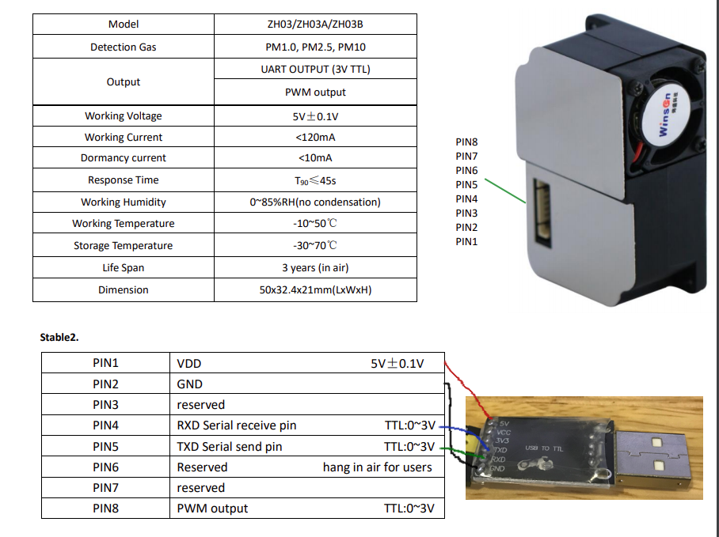
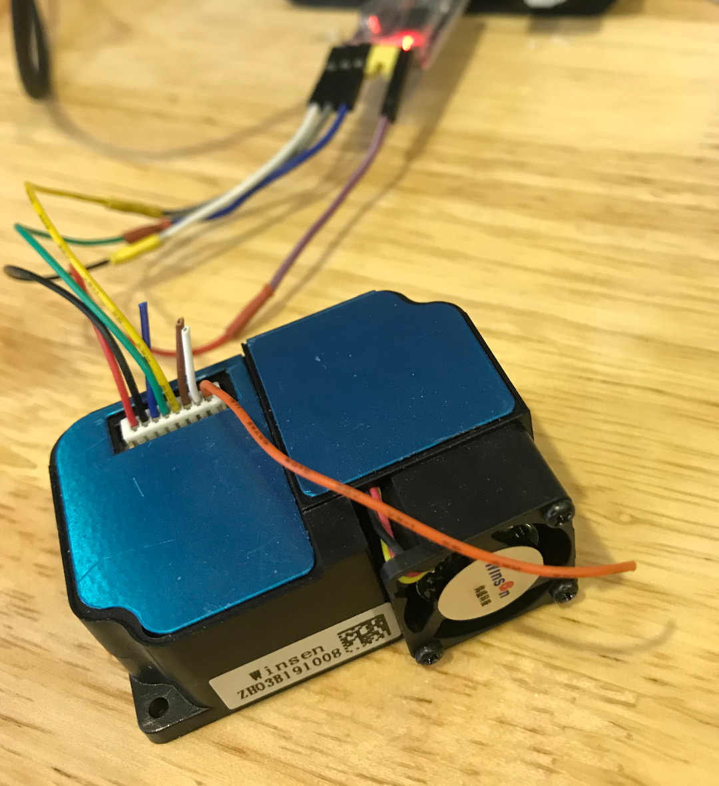

# ZH03B
- Air quality sensor (Winsen ZH03B) for PM1, PM2.5 and PM10 output by Python
- Check out the [datasheet](datasheet/zh03-series-laser-dust-module-v2_0.pdf)

## Wiring up
- Use a USB UART adapter and plug to USB port is the easiest way to get started.
- Pin 4 on ZH03B <----> TX pin on adapter
- Pin 5 on ZH03B <----> RX pin on adapter
- 5V and GND
<p align="center">
  
</p>
- ZH03B is in green metalic color
<p align="center">
  
</p>

## Run mode
### Upload
The sensor constantly output the PM1, PM2.5 and PM10 readings
### Q&A
A request sent to the sensor by the PC, the sensor returns the PMs reading
### Q&A with `dormant`
with addition to turn on and turn the sensor. The fan was tested as it can be turned on and off. Not sure about the diode.
## How to use the script?
### 1. Simple (aka: upload mode, default by sensor)
- run `examples.py`, make sure you get the correct USB port. Check it by run on terminal (Linux: `ls /dev/ttyUSB*`)
- the format reading look like this:
```
Sat Feb  8 16:03:57 2020
PM1: 17, PM2.5: 21, PM10: 23 in ug/m3
```
### 2. Run sensor and log datain request - get reading mode
- run `examples_log_data.py`. This allows to run the sensors until terminated the script. The data is saved into a CSV file
[CSV file](https://github.com/binh-bk/ZH03B/blob/master/Feb2020/zh03b_demo2.csv)

====
